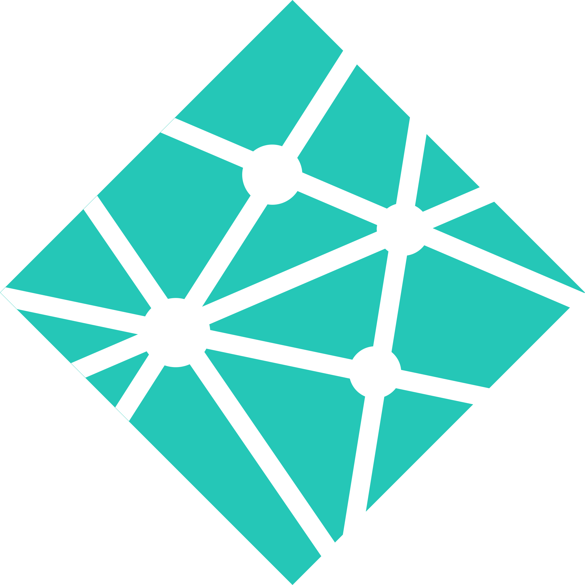

<h1 align="center">Hi 👋, I'm Deepak Mandal </h1>
<h3 align="center">A passionate Full Stack Web Developer from India</h3>

I’m currently learning full-stack web development 🔭 with a specialization in MERN stack from Masai School. Quick learner and an aspiring full-stack web developer with core knowledge of MERN stack technology. Looking forward to applying and enhancing my skills and knowledge as a developer.

<!--  -->

<!--  -->

- 👯 I’m looking to collaborate on **any awesome projects**

- 👨‍💻 All of my projects are available at [https://deepumandal.github.io/](https://deepumandal.github.io/)

- 💬 Ask me about **any tech related stuff, I will be happy to help**

- 📫 How to reach me **nomercyhunters@gmail.com**
   
   

---

## 💼 Languages and Tools:

<code></code>
<code></code>
<code></code>
<code></code>
<code></code>
<code></code>
<code></code>
<code></code>
<code></code>
<code></code>
<code></code>

<code></code>
<code></code>
<code></code>
<code></code>

<code></code>
<code></code>
<code></code>
<code></code>
<code></code>
<code></code>
<code></code>
<code></code>
<code></code>

---

 

  

      
  

## 📊 My Github Stats

   
    
  
   
  <b>Note:</b> Top languages is only a metric of the languages my public code consists of and doesn't reflect experience or skill level.

 
 

 

## Connect with me:

